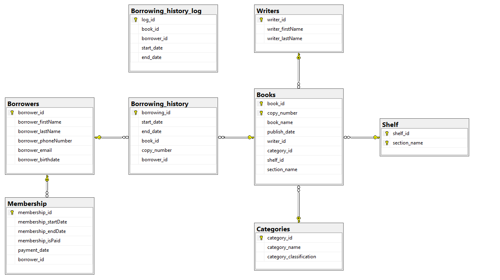
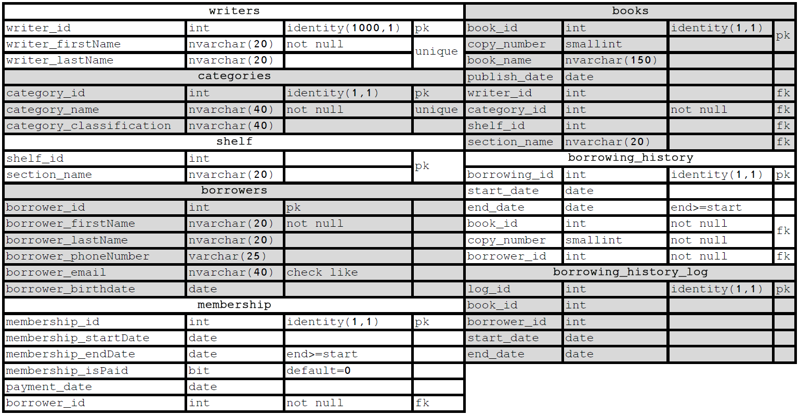

# Library_Database
SQL Create Database - Library

Library Database

1	Description

The library owns books for borrow to its members. Each book is associated to a writer and category, and there can be numerous copies for any book. In order to efficiently locate the books, they are marked by specific section and shelf. In order to borrow a book (or more), ones must be a member and its membership is paid and date valid. 
The system keeps Audit in a LOG table, updated every night at 2'AM.

2	ERD

 

3	Field list

	 

4	Dataset

4.1	References

"Mockaroo" for generating random Names (Borrower), Phone numbers, ID's, Emails, logical Dates, and ranged integers to associate existing entities PK - https://mockaroo.com/
"LibraryThing: Top 1000 books by authors", for list of books and writers -  https://www.librarything.com/z_books.php
"List of Book Types or Genres" for list of books' categories -  https://reference.yourdictionary.com/books-literature/different-types-of-books.html

4.2	Goal

Dataset implementation goal is to implement real actual Books and Writers entities.

4.3	Methods

In Excel, writer's full name column separated from books name, table sorted by writer. A new column added for unique writer ID, consecutive numbers and sensitive for duplicates using the IF function: IF (writerA2=writerA1, NumberB1, NumberB1+1).
In Excel, extracting the last name using formula based on the last space in the full name string:
Z= =FIND("*",SUBSTITUTE(A2," ","*",LEN(A2)-LEN(SUBSTITUTE(A2," ",""))))
=IFERROR(RIGHT(A2,LEN(A2)-Z), A2)
And, first name =IFERROR(LEFT(A2,Z),A2)

In Excel, punctuation mark Apostrophe (') removed from all strings, and to complete the table "Mockaroo" data was added. Then, table's data combined to a single column, using CONCATUNATE function in order to form: ('columnX', 'columnY').
In Sublime Text 3, the insert command text was joined with the Excel concatenated fixed column, using Ctrl-Shift-L for Edit All mode.

5	Create table

Create table (and Data inserts) is attached.  
  
[See Library Database code](https://github.com/amirnavon/Library_Database/blob/master/create_db_library.sql)

